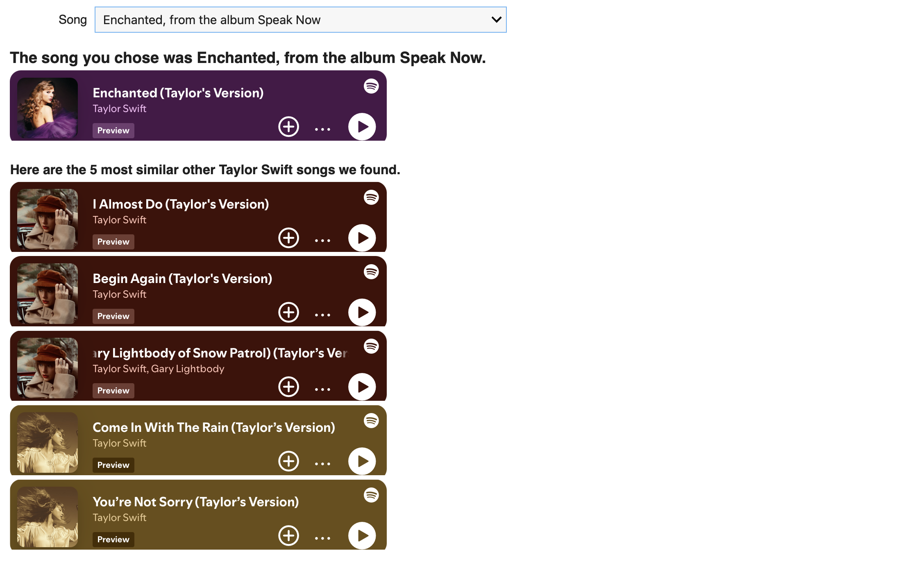

# TSwift Tunes: Exploring, Recommending & Searching Through Taylor Swift's Music

Welcome to the **TSwift Tunes** project! I completed this project as part of my **DSC 10** course at **UC San Diego**. This project explores Taylor Swift’s music through data analysis and machine learning. It includes visualizations, a song recommender system, and a lyrics searcher, all powered by the `tswift` dataset. The project answers key questions about her songs and albums, analyzes audio features, and provides interactive tools for song recommendations and lyric searching.

## Project Overview

This repository contains the following components:

- **Data Exploration and Visualization**: I use the `tswift` DataFrame to explore Taylor Swift's music and answer key questions.
- **Song Recommendation System**: I built a recommender that suggests similar songs based on audio features and user preferences.
- **Lyrics Searcher**: A tool that allows you to search for specific lyrics in Taylor Swift's songs using TF-IDF.
- **Keyword Extraction**: I identify key terms that best summarize each song from Taylor Swift's album *Lover*.

## Data Exploration and Visualization 👀

In this section, I explore Taylor Swift's music through various visualizations, helping answer the following key questions:

- **How many songs did Taylor Swift release each year?**  
  I analyze Taylor Swift's discography over time and track her song releases year by year.

- **How do different audio features like 'Loudness' and 'Energy' relate to one another?**  
  I create visualizations to explore the correlation between features such as loudness and energy across her songs.

- **Are Taylor Swift's songs generally more positive or more negative?**  
  I perform sentiment analysis to assess whether her songs lean towards a positive or negative emotional tone.

- **Which Taylor Swift album has the most songs in a minor key?**  
  I analyze the keys of her songs to identify which album has the highest number of songs in a minor key.

- **Collaborative vs. Solo Songs**:  
  Taylor Swift has collaborated with artists on songs like *"Snow On The Beach (Ft. Lana Del Rey)"* and *"Fortnight (Ft. Post Malone)"*. This visualization compares the average values of **Explicit**, **Danceability**, and **Acousticness** for collaborative versus solo songs using an overlaid vertical bar chart, highlighting the differences in these key features.

These visualizations provide insights into Taylor Swift's musical style, emotional tone, and the evolution of her discography.

## Song Recommender 🎧

The **Song Recommender** system allows you to find similar songs from Taylor Swift’s catalog based on audio features. This component lets users select a song and receive recommendations for 5 similar songs that match the characteristics of the chosen track.

### How to Use
- **Choose a song**: Select a song from the dropdown list.
- **Recommendations**: Once a song is selected, the system will display the song you chose and play a preview of it. It will also suggest 5 similar Taylor Swift songs based on features like energy, danceability, and popularity.
  
- **Listen to Previews**: The recommended songs will also have their previews played through Spotify.

## Lyrics Searcher 🔍

The **Lyrics Searcher** allows you to search for specific lyrics in Taylor Swift’s songs using TF-IDF. This tool is inspired by **Shayna Kothari's Online Tool for Taylor Swift Lyrics**, which provides a powerful way to analyze and query Taylor Swift's lyrics.

### Example Usage 
- **Enter a Search Term**: Type in any word or phrase from the lyrics to search for.
- **Retrieve Results**: The system will return the songs that have the highest relevance to the search term.
- **Review Song Excerpts**: See which songs contain the search term and review the lyrics.

  

## Keyword Extraction 🔑

In this component, I perform keyword extraction for each song in Taylor Swift's *Lover* album. I use the **TF-IDF** (Term Frequency-Inverse Document Frequency) method to identify the most significant words in the lyrics of each song.

### How it Works:
- **TF-IDF Calculation**: For each song's lyrics, I calculate the frequency of each word (Term Frequency) and how unique the word is across all songs (Inverse Document Frequency).
- **Word Cloud Generation**: After calculating the TF-IDF scores, I visualize the most important words for each song using a word cloud.

### How to Use
- **Select an Album**: Select a song from the dropdown list.
- **Extract Keywords**: The system will calculate the TF-IDF scores for all songs in the album and accordingly extract the top keywords for each song.
- **View Word Clouds**: A word cloud will be generated for each song, displaying the most relevant keywords based on the lyrics.
  
  
## Contributions 🤝

This project was developed as part of my [DSC 10](https://catalog.ucsd.edu/courses/DSC.html) class at UC San Diego. The [DSC 10 team](https://dsc10.com/staff/) provided invaluable support throughout the project, helping shape the direction of my analysis and guiding me with key insights. They provided essential data sources and offered hints to help me move forward with the project. 

Furthermore, the DSC 10 team played a crucial role in shaping my analysis into a more accessible form by transforming it into interactive widgets and creating a user-friendly interface. Their expertise in data science and user experience was essential to making this project engaging and easy to interact with.

This project would not have been possible without the contributions and support from the DSC 10 team, and I am extremely grateful for their assistance throughout the process.

## References and Data Sources 📖

Learning more about the data and analysis that inspired this project, check out Alice Zhao's blog post [A Data Scientist Breaks Down All 10 Taylor Swift Albums (The Extended Version)](https://adashofdata.com/2023/03/01/a-data-scientist-breaks-down-all-10-taylor-swift-albums-the-extended-version/). Below are links to all the resources I used in developing this project. Thanks to all the people who provided these resources!

- Shayna Kothari, [Taylor Swift Lyric Searcher](https://shaynak.github.io/taylor-swift/) and [source code](https://github.com/shaynak/taylor-swift) 
- Tia Plagata, [How to Create Beautiful Word Clouds in Python](https://towardsdatascience.com/how-to-create-beautiful-word-clouds-in-python-cfcf85141214)
- Melanie Walsh, [Introduction to Cultural Analytics & Python](https://melaniewalsh.github.io/Intro-Cultural-Analytics/welcome.html)
- Cameron Watts, [Extracting Song Data From the Spotify API Using Python](https://towardsdatascience.com/extracting-song-data-from-the-spotify-api-using-python-b1e79388d50)
- Alice Zhao, A Dash of Data, [A Data Scientist Breaks Down All 10 Taylor Swift Albums (The Extended Version)](https://adashofdata.com/2023/03/01/a-data-scientist-breaks-down-all-10-taylor-swift-albums-the-extended-version/) and [source code](https://github.com/adashofdata/taylor_swift_data)
- Lyrics data from [Genius API](https://genius.com/)
- Musical data from [Spotify API](https://developer.spotify.com/)
